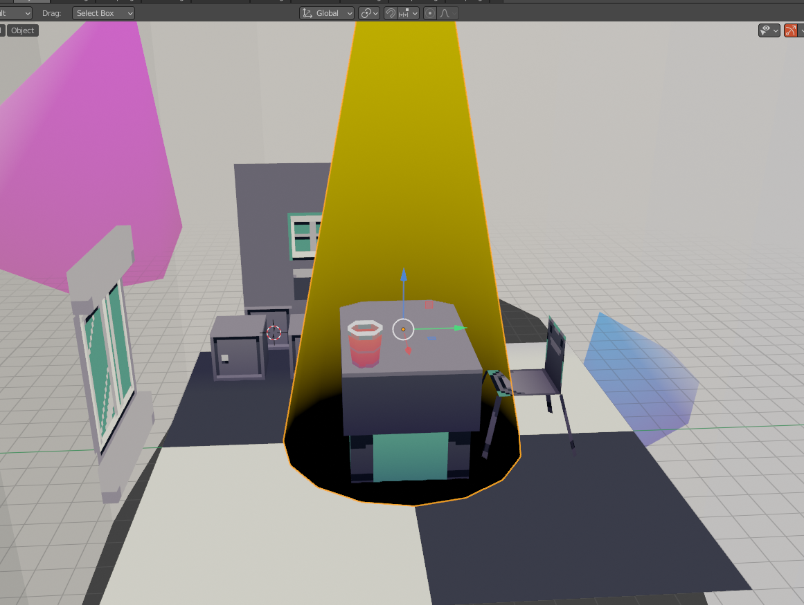

<br>
***export_obj_adv***: .obj file exporter with ***vertex colour support*** for Blender
===
:warning: ***This is `HEAVILY` unstable and won't be maintained!*** :warning:<br>I originally hastily wrote this in a few hours for a [short 3D demo/animation](https://youtu.be/Q4PYBJL-H6w) I was working circa 2021, and this repository was created only for the sake of archival and 'educational' purposes. <br>



------
The vertex colour will only work with exporting (as that was the only function I needed back in time), And the colour information would be stored after the vertex position values like the following:
```
(the usual, vertex notation in .obj file)
v x y z
(mesh has vertex colour information)
v x y z r g b a
```
<br>
You probably should use this as a temporary solution at best... I suppose.<br>
Have fun and please don't rely on this too much. Thankyouvermuch - ZIK